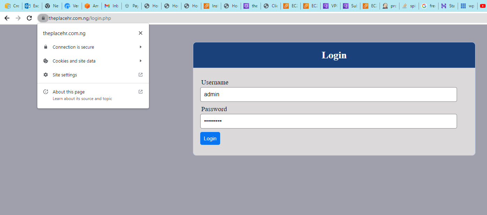

## **NGINX Load Balancer solution with SSL/TLS**

In our last project we used Apache as our load balancer, here we will configure Nginx as our load balancer, register a new domain name and configure secured connection using SSL/TLS certificates.

We will have a build/architecture as shown below.


##  1. Configure Nginx as a Load Balancer

- Create an EC2 VM based on Ubuntu Server. (do not forget to open TCP port 80 for HTTP connections, also open TCP port 443 – this port is used for secured HTTPS connections)

- Update /etc/hosts file for local DNS with Web Servers’ names (e.g. Webserver1 and Webserver2) and their local IP addresses


- Install and configure Nginx as a load balancer to point traffic to the resolvable DNS names of the webservers

``````
sudo apt update
sudo apt install nginx
``````
- Open the default nginx configuration file

    `sudo vi /etc/nginx/nginx.conf`

``````
#insert following configuration into http section

 upstream myproject {
    server Webserver1 weight=5;
    server Webserver2 weight=5;
  }

server {
    listen 80;
    server_name www.domain.com;
    location / {
      proxy_pass http://myproject;
    }
  }

#comment out this line
#       include /etc/nginx/sites-enabled/*;
``````

- Restart Nginx and make sure the service is up and running

``````
sudo systemctl restart nginx
sudo systemctl status nginx
``````
##  2. We will get a new domain name and configure secured connection using SSL/TLS certificates

- Register a new domain name with any registrar of your choice in any domain zone (e.g. .com, .net, .org, .edu, .info, .xyz or any other)

- Create a hosted zone add the records as shown below.

- Update A record in your registrar to point to Nginx LB using Elastic IP address or public IP of the Nginx load balancer.


- Check that your Web Servers can be reached from your browser using new domain name using HTTP protocol – http://<your-domain-name.com>

- Configure Nginx to recognize your new domain name

- Update your nginx.conf with server_name www.<your-domain-name.com> instead of server_name www.domain.com

- Install certbot and request for an SSL/TLS certificate

- Make sure snapd service is active and running

    `sudo systemctl status snapd`

- Install certbot

    `sudo snap install --classic certbot`

- Request your certificate (just follow the certbot instructions – you will need to choose which domain you want your certificate to be issued for, domain name will be looked up from nginx.conf file so make sure you have updated it on step 4).

``````
sudo ln -s /snap/bin/certbot /usr/bin/certbot
sudo certbot --nginx
``````

- Test secured access to your Web Solution by trying to reach https://<your-domain-name.com>



- Set up periodical renewal of your SSL/TLS certificate

- By default, LetsEncrypt certificate is valid for 90 days, so it is recommended to renew it at least every 60 days or more frequently.  You can test renewal command in dry-run mode

    `sudo certbot renew --dry-run`

- Best practice is to have a scheduled job that to run renew command periodically. Let us configure a cronjob to run the command twice a day.

- To do so, lets edit the crontab file with the following command:

    `crontab -e`

- to see list of cron jobs

    `crontab -l`

- Add following line on edit.

    `* */12 * * *   root /usr/bin/certbot renew > /dev/null 2>&1`

``````
*--minutes
*/12--hours (runs after every 12 hours)
*--day
*--month
*--SUN MON TUE etc
``````