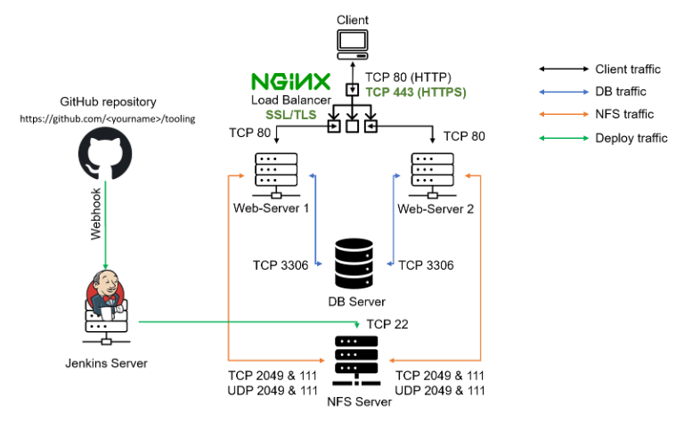

## **NGINX Load Balancer solution with SSL/TLS**

In our last project we used Apache as our load balancer, here we will configure Nginx as our load balancer, register a new domain name and configure secured connection using SSL/TLS certificates.

We will have a build/architecture as shown below.



##  1. Configure Nginx as a Load Balancer

- Create an EC2 VM based on Ubuntu Server. (do not forget to open TCP port 80 for HTTP connections, also open TCP port 443 – this port is used for secured HTTPS connections)

- Update /etc/hosts file for local DNS with Web Servers’ names (e.g. Webserver1 and Webserver2) and their local IP addresses


- Install and configure Nginx as a load balancer to point traffic to the resolvable DNS names of the webservers

``````
sudo apt update
sudo apt install nginx
``````
- Open the default nginx configuration file

    `sudo vi /etc/nginx/nginx.conf`

``````
#insert following configuration into http section

 upstream myproject {
    server Web1 weight=5;
    server Web2 weight=5;
  }

server {
    listen 80;
    server_name www.domain.com;
    location / {
      proxy_pass http://myproject;
    }
  }

#comment out this line
#       include /etc/nginx/sites-enabled/*;
``````

- Restart Nginx and make sure the service is up and running

``````
sudo systemctl restart nginx
sudo systemctl status nginx
``````


